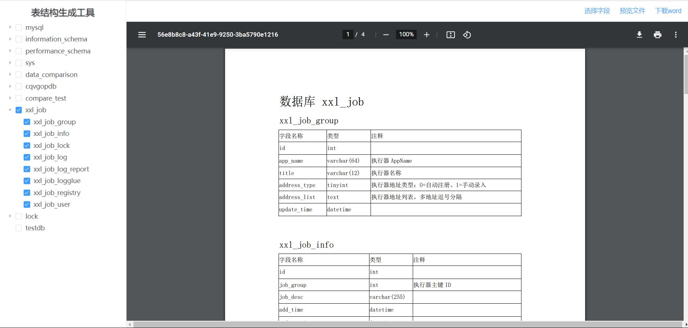
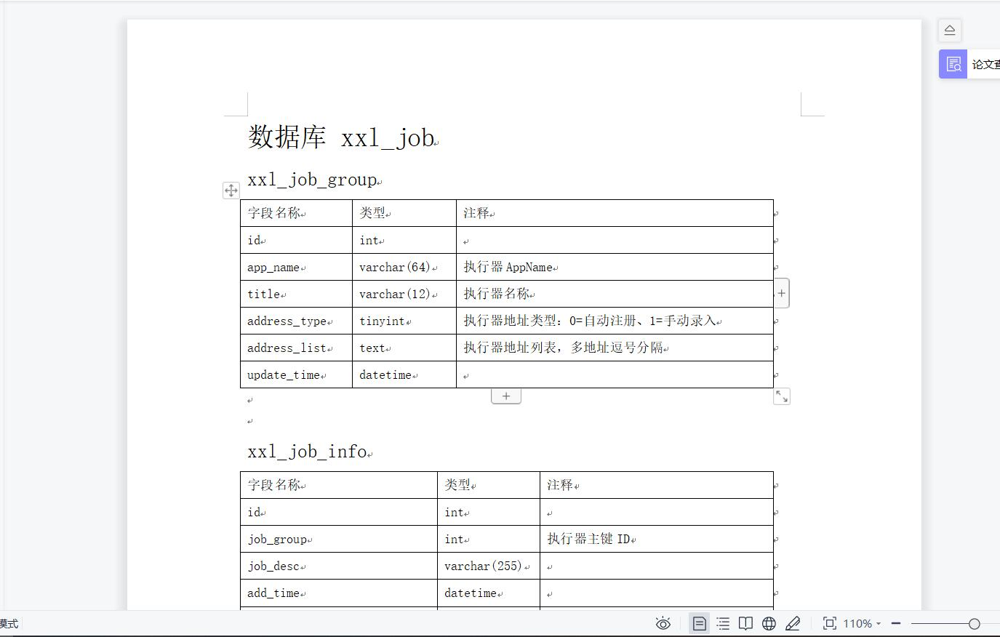

# 数据库表结构生成工具

#### 开发缘由

工作中写开发文档时，通常都会有数据库表结构这一项，word中新建表格，然后一个一个复制粘贴效率太低，之前也有写过一个版本，没有页面的，更改连接数据库信息需要更改配置文件信息，使用起来觉得还是不是很方便，所以就有了开发一个带页面的版本的想法。

#### 技术栈

SpringBoot + Vue2 + Element ui + Apache poi

#### 项目架构

B/S 架构

#### 项目演示

**1. 数据库连接信息页面**

**2. 预览文件**

**3. 下载打开文件**

**4. 选择字段**

#### 使用说明

**默认访问地址：http://localhost:8080/**

**注意：由于项目中预览功能用到了 word 转 pdf 功能，未找到免费的且转换后格式不变的工具，所以预览功能需依赖于本地 office 环境**

#### exe下载
**https://gitee.com/geqian618/table-structure-generator/raw/dev/exe/%E8%A1%A8%E7%BB%93%E6%9E%84%E7%94%9F%E6%88%90%E5%99%A8.7z**

