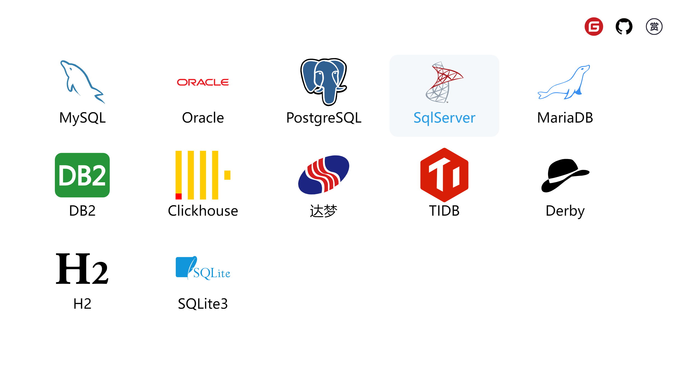
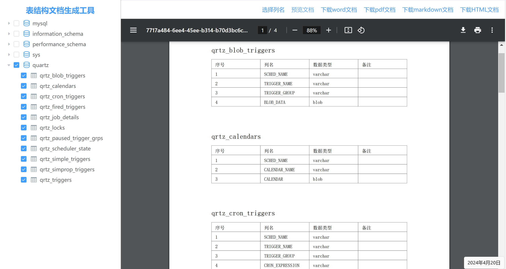

# 数据库表结构文档生成工具

## 开发缘由

在工作中编写开发文档时，通常会涉及到数据库表结构这个部分。最开始使用各类文档编辑软件新建表格，然后逐个复制和粘贴内容，屏幕来回切换到头昏眼花，CV操作到手抽筋，不注意还可能看错数据或填写表格时填错数据。之前也有尝试过编码+修改配置文件的方式，但是在更改数据库连接信息、导出哪些表及列信息时需要手动修改配置文件，使用起来并不是很方便。于是就萌生了开发该项目的想法，以简化数据库文档的编写。
 
 

## 技术栈

### 后端

- 采用 SpringBoot 作为基础框架
- 采用 apache poi 生成word文档
- 采用 itextpdf 生成pdf文档
- 采用 snakeyaml 解析yaml文件

### 前端

- 采用 Vue2 作为基础框架
- 采用 Element ui 作为组件库
   
   

## 优势

- 灵活性高，可根据需求灵活选择导出的表列数据
- 扩展性良好，适配新的数据库类型，只需提供对应的查询SQL语句，几乎不需要额外的编码
- 树形控件采用懒加载模式加载数据，避免数据量太大时，一次性加载全部数据，造成严重卡顿
- 多线程加载数据，提高数据量较大时的导出速度

 

## 支持数据库类型

- MySQL
- Oracle
- PostgreSQL
- Sql Server
- DB2
- MariaDB
- Clickhouse
- 达梦
- TIDB

> 导出数据通过 SQL 查询的方式获取，本人技术水平有限，对许多数据库并不熟悉，绝大部分 SQL
> 语句都是通过网络搜索获取的。如果导出的数据存在错误或不符合预期，望海涵，可以积极提出反馈哦。

 

## 支持文档类型

- Word
- PDF
- Markdown
- HTML

 
 

## 项目演示

**1. 数据库连接**

**2. 文档预览**

 
 

**3. 选择导出列名**

  
 
 

**4. 下载pdf文档**

 
 

**5. 下载word文档**

  
 
 

**6. 下载markdown文档**

  
 
 

**7. 下载HTML文档**

  
 
 

## 使用说明

**默认访问地址：http://localhost:8888/**
> 项目启成功后自动打开浏览器进行访问

 

## windows下载

链接：https://pan.baidu.com/s/1XgEMOwAxNGvFjt46v1-Aow
提取码：ywap
> 由于安装包内置 JDK 环境，体积有点大，无法上传到 Gitee

 
 

## 赞赏

 
 

## 参考说明

数据库连接页面布局参考至：https://gitee.com/pomz/database-export